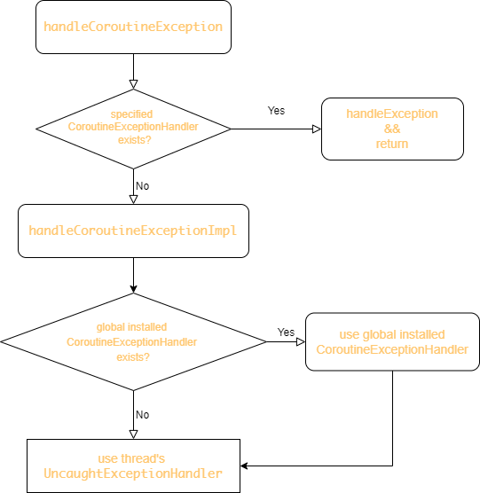

# safe-kotlinx-coroutines

这是一个防止因协程发生异常而导致应用崩溃的一个库。

我们知道给协程添加 `CoroutineExceptionHandler` 有两种方式：

1. 在 launch 的时候显式指定一个 `CoroutineExceptionHandler`；
2. 在 resources/META-INF/services/ 目录下创建 `kotlinx.coroutines.CoroutineExceptionHandler` 文件，文件中指定一个全局的 `CoroutineExceptionHandler` 实现类。

协程的异常处理流程如下：

本库是通过修改 `handleCoroutineException` 方法，如果没有找到 `CoroutineExceptionHandler`，则走我们自己的异常处理流程。